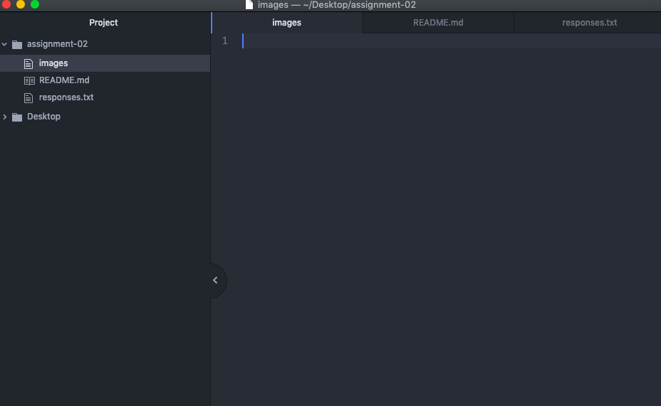

# Assignment-02
## Kylin Rosling

I decided to take this class because it is a requirement for a minor in media arts, but also because I believe that it is important to have multiple skills and abilities in different programs.

1. I have learned that there is more than one part to a URL.
2. I have learned the differences between a IP address and DSN
3. I hope to learn how to become proficient in Git hub and Atom.

[Website](http://umonline.umt.edu/)

[Website](https://moodle.umt.edu/)

[My Responses File](./responses.txt)

