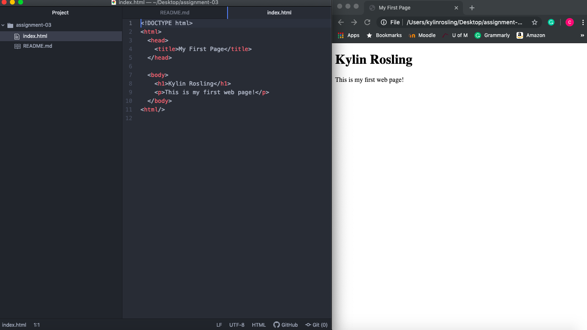

A browser is used to locate and display content. The browser is run on a computer that contacts a web server and request information. I most commonly use Chrome or Safari.

A markup language is a file that contains standard words instead of syntax. HTML is the language commonly used for web pages.

